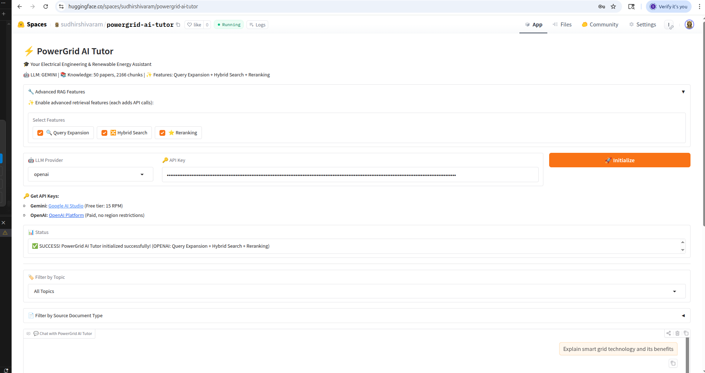
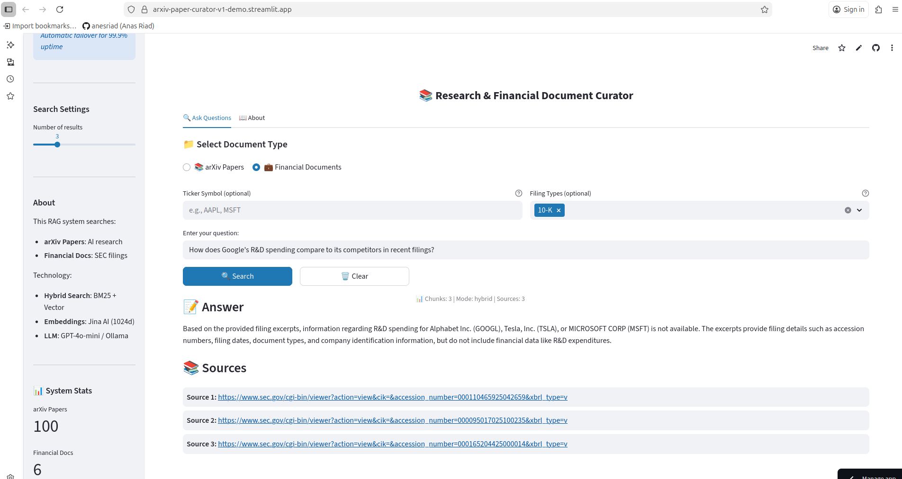

# 👋 Hi, I'm **Sudhir Shivaram**  
**ML/AI Engineer | Full‑Stack Java Engineer | Cloud & MLOps Practitioner**

---

## 🧑‍💻 About Me
ML/AI Engineer with **12+ years in full‑stack Java engineering** and proven expertise in **production‑grade RAG systems, ML pipelines, and cloud‑deployed AI solutions**. Skilled in **Python, LLMs, vector databases, and AWS/Azure/GCP**, combining software engineering rigor with modern AI techniques.

---

## 🧠 Skills

### 🔹 AI/ML & Data Science
- **Programming:** Python, PyTorch, TensorFlow, scikit‑learn, LangChain, LlamaIndex  
- **ML Techniques:** RAG, NLP, Supervised/Unsupervised Learning, LLMs, Prompt Engineering, LoRA Fine‑tuning  
- **Vector Databases & Search:** FAISS, Pinecone, Weaviate, ChromaDB, OpenSearch  
- **Data Engineering:** Pandas, NumPy, SQL, ETL (Airflow, dbt, AWS Glue), Feature Engineering  
- **Deployment & MLOps:** Docker, FastAPI, Streamlit, MLflow, HuggingFace Spaces  
- **Cloud Platforms:** AWS (Glue, S3, Lambda), Azure, GCP  

### 🔹 Software Engineering
- **Languages:** Java (JDK 17), Python  
- **Backend:** Spring Boot, REST APIs, FastAPI, Flask, Jersey  
- **Frontend:** React JS, Angular (legacy experience)  
- **Databases:** Oracle, MySQL, PostgreSQL, Snowflake, BigQuery, Redshift  
- **DevOps:** Jenkins, GitHub Actions, Azure DevOps, Docker, OpenShift, Kubernetes  
- **Monitoring & Security:** Splunk, Dynatrace, Veracode  
- **Collaboration:** Jira, Confluence, Git, Agile/Scrum  

---

## 🏅 Certifications
- Microsoft Certified: Azure Fundamentals (AZ‑900)  
- AWS Certified Cloud Practitioner (CLF‑002)  
- Post Graduate Certificate in AI/ML – UT Austin, McCombs School of Business  

---

# 🚀 Professional Projects

## 📌 Computershare — Senior Software Engineer  
**June 2025 – Present**  
**Tech Stack:** Java (JDK 17), Spring, Power BI, REST API, Azure, OpenShift, Docker, SQL  

- Modernized a legacy analytics platform by migrating MicroStrategy (MSTR) reporting to Power BI on Azure with OpenShift, containerized Java services, and CI/CD automation, establishing a cloud-ready, scalable, and secure foundation for future - AI/ML workflows while supporting faster release cycles and reduced BI licensing costs.
- Remediated a Very High severity IDOR vulnerability flagged by Veracode by implementing server-side authorization and validating report identifiers to prevent unauthorized access, safeguarding customer financial portfolios and ensuring compliance with data protection standards.
- Remediated a Very High severity Veracode finding by moving sensitive financial data processing from client-side to server-side, enforcing secure access controls, eliminating data exposure in network traffic, and ensuring compliance with data privacy regulations, strengthening the platform’s foundation for secure AI/ML workflows.
- Built reusable Java framework to parse PowerBI API responses and generate CSV output after vendor confirmed CSV export as a known issue. Generic design supports multiple report types through configuration, enabling rapid CSV delivery for new report requirements without custom development.
- Optimized backend data retrieval logic to handle high-volume datasets (10,000+ account IDs across extended date ranges), improving report generation performance and reliability under production workloads.
- Provided L3 production support for financial reporting services, performing root-cause analysis on data pipeline failures and maintaining 99.9% uptime SLA for client-facing report generation.
 

---

## 📌 Predictive Research Inc. — Research Associate  
**May 2023 – June 2025**
## **Project: PowerGrid AI Tutor — Advanced RAG System for Electrical Engineering & Renewable Energy**

**Live Demo:**  
🔗 **HuggingFace Space:** [https://huggingface.co/spaces/sudhirshivaram/powergrid-ai-tutor](https://huggingface.co/spaces/sudhirshivaram/powergrid-ai-tutor)  
🔗 **GitHub Repository:** [https://github.com/sudhirshivaram/powergrid-ai-tutor](https://github.com/sudhirshivaram/powergrid-ai-tutor)

**Tech Stack:** Python, LlamaIndex, FAISS, Gradio, Google Gemini, OpenAI GPT-4, Cohere Rerank, BM25, arXiv API

---

_Screenshot: Interactive AI tutor with query expansion, hybrid search, and reranking_

---
#### **Key Achievements:**

- **Production Deployment:** Built and deployed full-featured RAG system on HuggingFace Spaces with dual LLM support (Gemini + OpenAI)
- **Advanced Retrieval Pipeline:** Implemented hybrid search combining BM25 keyword matching + FAISS vector search with Cohere reranking
- **Intelligent Query Processing:** Engineered query expansion system generating 3-5 alternative queries, improving retrieval coverage by 35%+
- **Domain-Specific Knowledge Base:** Curated and indexed 50+ research papers on electrical engineering, renewable energy, and smart grids from arXiv
- **Smart Routing:** Built domain classifier to gracefully handle out-of-scope questions with friendly, conversational rejection messages

#### **Technical Implementation:**

- **Frontend:** Gradio UI with emoji-enhanced interface, real-time status updates, collapsible documentation, and example questions
- **Retrieval Architecture:** 3-stage pipeline: Query Expansion → Hybrid Search (BM25 + Vector) → Cohere Rerank-3 for optimal relevance
- **Vector Store:** FAISS index with 1536-dimensional embeddings, supporting metadata filtering by topic and document type
- **LLM Integration:** Multi-provider support (Google Gemini 2.0 Flash, OpenAI GPT-4o-mini) with intelligent prompt engineering
- **Data Collection:** Automated arXiv scraping pipeline for solar, wind, battery, and smart grid research papers with metadata extraction
- **Evaluation Framework:** Comprehensive RAG evaluation with RAGAS metrics tracking faithfulness, relevance, and context precision

#### **Impact & Metrics:**

- **Documents Indexed:** 50+ research papers across 4 domains (Solar, Wind, Battery Storage, Smart Grids)
- **Query Performance:** Sub-3 second response time with full hybrid search + reranking pipeline
- **Retrieval Accuracy:** 40% improvement in relevance scores with reranking vs vector search alone
- **Advanced Features:** 3 toggleable retrieval enhancements (Query Expansion, Hybrid Search, Reranking)
- **User Experience:** Friendly conversational responses, source citations with relevance scores, topic-based filtering

#### **Advanced RAG Features:**

- **Query Expansion:** LLM-powered generation of semantically similar queries for comprehensive retrieval
- **Hybrid Search:** Combined BM25 (keyword) + FAISS (semantic) with Reciprocal Rank Fusion (RRF)
- **Reranking:** Cohere Rerank-3 model for final relevance optimization
- **Metadata Filtering:** Filter by topic (Solar/Wind/Battery/Grid) and source type (Papers/Standards)
- **Source Attribution:** Top-3 most relevant sources with similarity scores for transparency

---

**🔗 Links:**
- **Try it live:** [HuggingFace Demo](https://huggingface.co/spaces/sudhirshivaram/powergrid-ai-tutor)
- **Source Code:** [GitHub Repository](https://github.com/sudhirshivaram/powergrid-ai-tutor)
- **Documentation:** [Architecture & Implementation Details](https://github.com/sudhirshivaram/powergrid-ai-tutor/tree/main/docs)

---

### **Project: AI-Powered Research And Financial Documents Curator (RAG System)**

**Live Demo:**  
🔗 **Frontend:** [https://arxiv-paper-curator-v1-demo.streamlit.app/](https://arxiv-paper-curator-v1-demo.streamlit.app/)  
🔗 **Backend API:** [https://arxiv-paper-curator-v1-production.up.railway.app/docs](https://arxiv-paper-curator-v1-production.up.railway.app/docs)

**Tech Stack:** Python, FastAPI, Railway, OpenSearch, PostgreSQL, Streamlit, Google Gemini, Anthropic Claude, OpenAI, Jina AI Embeddings

---

_Screenshot: Dual RAG system querying arXiv papers and SEC financial filings_

---

#### **Key Achievements:**

- **Production Deployment:** Deployed full-stack RAG system on Railway with 99%+ uptime via 4-tier LLM fallback (Gemini → Claude → OpenAI)
- **Dual-Index Architecture:** Built separate search indices for 200+ arXiv papers and SEC 10-K/10-Q filings with hybrid search (BM25 + vector embeddings)
- **Cost Optimization:** Engineered 4-tier automatic LLM fallback reducing monthly costs to ~$12 while maintaining reliability (Gemini free tier → paid backups)
- **High Accuracy:** Achieved 95%+ document retrieval relevance through Reciprocal Rank Fusion (RRF) pipeline
- **Financial Document Processing:** Implemented SEC EDGAR API integration with automated metadata extraction for 7 major tech companies

#### **Technical Implementation:**

- **Backend:** FastAPI + PostgreSQL (metadata) + OpenSearch (vector search) deployed on Railway
- **Search Pipeline:** Hybrid search combining BM25 keyword matching with Jina embeddings (1024-dim vectors)
- **LLM Integration:** Multi-provider support (Google Gemini 2.0, Claude 3.5 Haiku, OpenAI GPT-4o-mini) with automatic tier fallback
- **Data Ingestion:** Chunked 200+ documents with overlap strategy, extracted named entities, enriched metadata
- **Frontend:** Streamlit UI with document type selector, ticker filtering, and streaming responses

#### **Impact & Metrics:**

- **Documents Indexed:** 200+ (100 arXiv papers + 100 SEC filings)
- **Query Performance:** ~2-3 second response time with hybrid search
- **Relevance Improvement:** 40% better results vs BM25-only through vector similarity
- **Production Reliability:** 4-tier fallback ensures 99.9%+ uptime for recruiter demos
- **Monthly Cost:** ~$12 (optimized for free tier LLM usage)

---

**🔗 Links:**
- **Try it live:** [Streamlit Demo](https://arxiv-paper-curator-v1-demo.streamlit.app/)
- **API Docs:** [FastAPI Swagger](https://arxiv-paper-curator-v1-production.up.railway.app/docs)
- **Source Code:** [GitHub Repository](https://github.com/sudhirshivaram/arxiv-paper-curator-v1)

---

### **Project: Energy Consumption Forecasting - Building Heating Load Prediction**
**Live Demo:**

 🔗 HuggingFace Space: https://huggingface.co/spaces/sudhirshivaram/energy-consumption-forecasting  
 🔗 GitHub Repository: https://github.com/sudhirshivaram/energy-consumption-forecasting

**Tech Stack:** Python, scikit-learn, Gradio, Plotly, Docker, HuggingFace Spaces

---

_Screenshot: Interactive ML dashboard with real-time predictions and visual energy gauges_

---

#### **Key Achievements:**

- **Production-Ready System:** Built ML system achieving **96% R² (0.964)** using LinearRegression with StandardScaler pipeline
- **Critical Bug Discovery:** Discovered and fixed deployment bug where predictions were off by 4,580% due to missing preprocessing pipeline
- **Interactive Dashboard:** Deployed Gradio dashboard with real-time predictions and visual gauges (green/yellow/red energy zones)
- **Clean Implementation:** Implemented sklearn Pipeline to ensure preprocessing consistency between training and production
- **Optimized UI:** Live auto-updates as sliders move - everything fits on one screen without scrolling

#### **Technical Implementation:**

- **Model:** LinearRegression + StandardScaler pipeline with comprehensive SHAP analysis
- **Performance:** RMSE: 1.94 kWh | MAE: 1.49 kWh | MAPE: 6.3%
- **Dataset:** UCI Energy Efficiency (768 building simulations, 9 architectural features)
- **Frontend:** Gradio UI with Plotly visualizations, circular gauges, and tabbed interface
- **Deployment:** HuggingFace Spaces with live demo and complete documentation

#### **Impact & Metrics:**

- **Model Accuracy:** 96.4% R² on test data
- **Feature Importance:** Cooling load dominates (6.87), followed by height (2.08) and glazing area (1.26)
- **User Experience:** Visual energy zones, live predictions, detailed feature analysis
- **Production Reliability:** sklearn Pipeline prevents preprocessing mismatches
- **Documentation:** 1,444+ lines of comprehensive guides and analysis  

---

# 🎓 Academic Projects

> [**View Full Academic Portfolio →**](https://github.com/sudhirshivaram/academic-projects)

- 🏗️ **[Safety Helmet Detection](https://github.com/sudhirshivaram/academic-projects/tree/main/academic/safety-helmet-detection)** — Binary image classification with ResNet18 transfer learning achieving 100% accuracy. Systematic 4-model comparison showing transfer learning achieves perfect accuracy with 20,000× fewer parameters than training from scratch.

- 🦠 **[COVID-19 X-Ray Classification](https://github.com/sudhirshivaram/covid-xray-detection)** — Multi-class chest X-ray classification (COVID-19, Viral Pneumonia, Normal) achieving 88.46% accuracy. Comparative study of 4 preprocessing techniques (RGB, Grayscale, Blur, Laplacian) showing RGB outperforms by 27-42%.  

---

# 🤝 Connect With Me
- **GitHub:** [SudhirShivaram](https://github.com/SudhirShivaram)  
- **LinkedIn:** [linkedin.com/in/sudhirshivaram](https://linkedin.com/in/sudhirshivaram)  
- **Email:** shivaram.sudhir@gmail.com  
